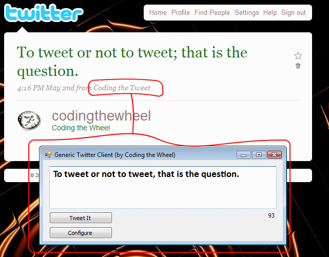

CodingTheTweet
===

An **ancient custom Twitter client** illustrating how to post attributed
tweets. Reconstituted from the [Wayback Machine's][0] archives of two old blog
posts:

- [Coding the Tweet][1]
- [Coding the Tweet, Redux][2]

**Note:** This code is ~10 years old and attributed tweets are no longer
permitted by Twitter, among other API changes. It's included here for archival
purposes only.

## License

MIT.

*Copyright (c) 2009, 2019 James M. Devlin*

[0]: https://archive.org/web/
[1]: https://web.archive.org/web/20150223232109/http://codingthewheel.com/archives/codingthetweet
[2]: https://web.archive.org/web/20150223232109/http://codingthewheel.com/archives/coding-the-tweet-redux
